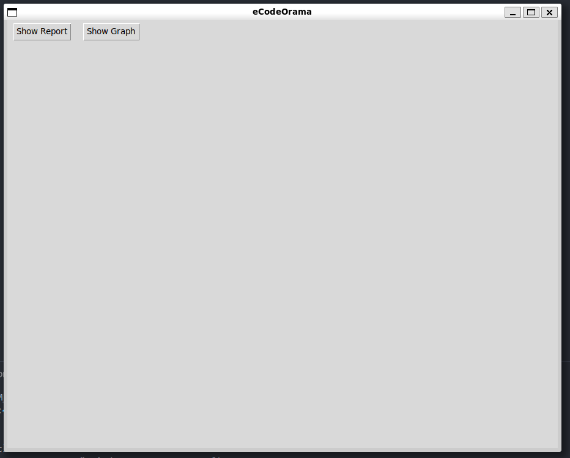
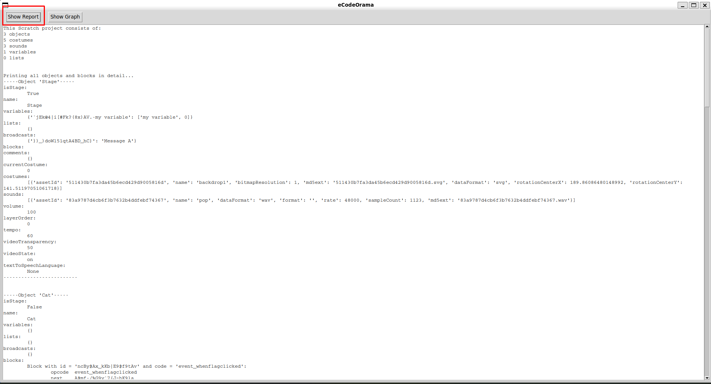
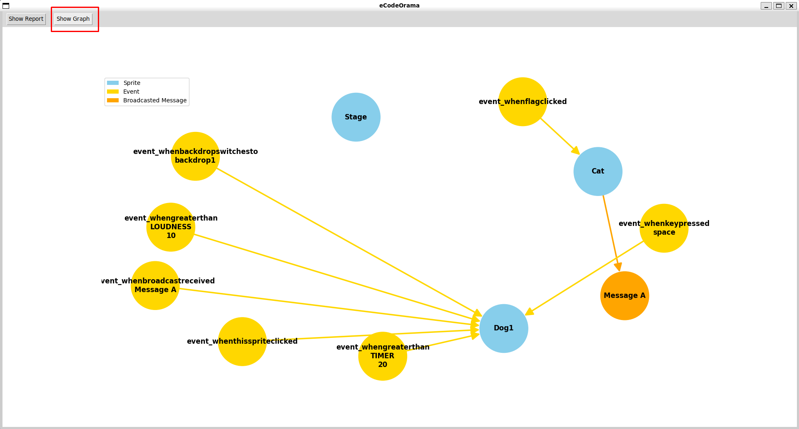
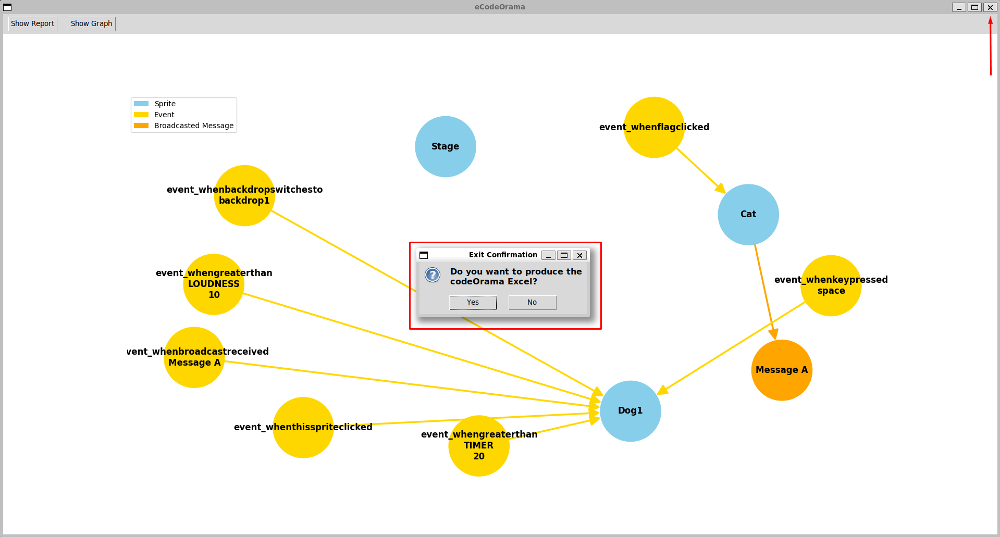
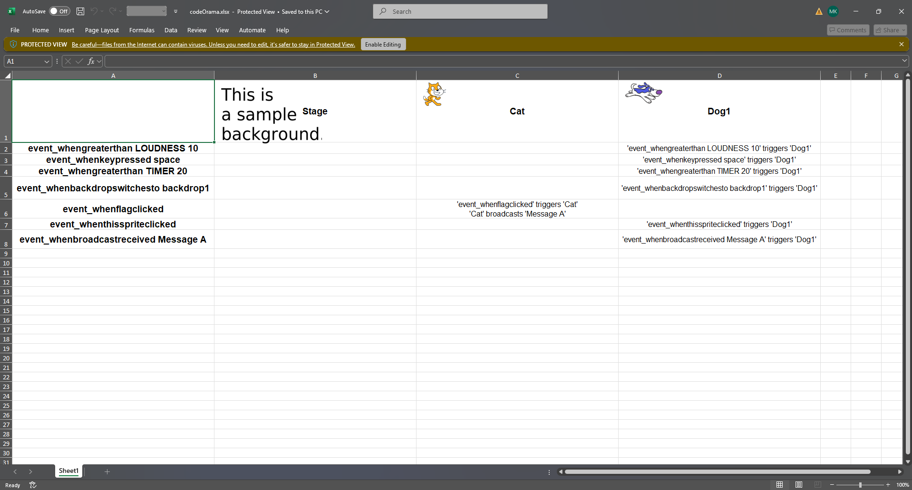

# eCodeOrama Early Development

A powerful Python-based tool that helps visualize and analyze Scratch `.sb3` project files. It parses project content, generates visual graphs of events and broadcasts, and produces a detailed Excel report — all via a user-friendly GUI.

---

## Repository Structure

```bash
├── eCodeOrama_basics/      # Some basic .sb3 file parsing/editting and codeOrama skeleton building. Can be used as a tutorial for beginners
├── my_code_oramas/         # My personally developed codeOramas and my "Scratch and codeOrama" lecture slides
├── sb3_files/              # Some example `.sb3` files
├── codeOrama.py            # Main entry point (parses .sb3, launches GUI, builds codeOrama)
├── codeOrama.xlsx          # Generated codeOrama Excel report
├── excel.py                # Code for generating codeOrama Excel reports
├── graph.py                # Code for drawing directed event/broadcast graphs
├── gui.py                  # GUI logic (buttons, interactivity, integration)
├── parser.py               # Parses project.json which follow Scratch format
├── requirements.txt        # Python dependencies
├── README.md               # README
└── .gitignore              # gitignore
```

## Setup
Before running the program, we need to create a virtual Python environment and install its dependencies.
```bash
python3 -m venv venv
source venv/bin/activate
pip install -r requirements.txt
```

## Features
This program allows users to interactively explore the structure of a Scratch project by switching between two main visual modes: a scrollable **textual report** and a **graphical representation** of event flow:
* The report displays detailed information about all objects, variables, costumes, sounds, and blocks in the project in a readable format.
* The graph view visualizes the logical flow of events and broadcasts between sprites using a color-coded directed graph. 

Additionally, upon exiting the application, the user can generate a fully styled Excel report, complete with embedded sprite icons and formatted descriptions of interactions.

The GUI is lightweight and responsive, built entirely with Tkinter, meaning that no external servers or browser dependencies are required.

## Run
We run the following command in our terminal:
```bash
python3 codeOrama.py <path_to_sb3_file> <path_to_extract_sb3_file_contents>
```

### Example
* Let's run the following command:
```bash
python3 codeOrama.py ./sb3_files/events.sb3 ./extracted
```

* After running the command, the GUI window will pop up.


* Click Show Report to generate a scrollable text view with all parsed project contents and information.


* Click Show Graph to generate a directed graph showing event-trigger-message flow. 
    
    Nodes are color-coded:
    * Blue nodes represent sprites.
    * Yellow nodes represent events.
    * Orange nodes represent messages.

    Edges are also color-coded:
    * Yellow edges begin from events and end on sprites. These edges indicate that the event triggers a script found inside of the sprite.
    * Orange edges begin from sprites and end on events. These edges indicate that the sprite broadcasts the given message.


* Clicking the `X` button on the top-right asks the user whether they want to produce the `codeOrama.xlsx` file of the given Scratch project or not. If the user presses the `Yes` button, the Excel file is created. 


* This is the final Excel that the program produces if the user presses `Yes`, as it is shown on Windows.

